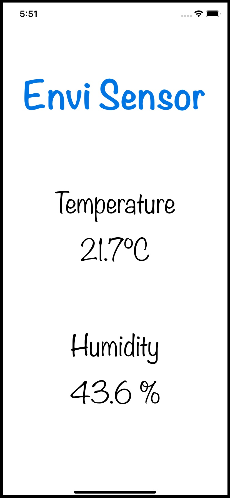

# Envi Sensor iOS

A single page iOS application acting as a BLE GATT Client for the [Envi Sensor](https://github.com/dehre/esp32-envi-sensor).

Every 15 seconds, it requests the current temperature and humidity to the ESP32 board and displays them.

## Disclaimer

I cannot take any credit for this fork, as I'm not an iOS or Swift developer, and I just tried to "brute-force" update the application until I got it working for me.  

## License
[MIT](https://choosealicense.com/licenses/mit/)

## Screenshot

Here's how it looks from the XCode Simulator:

